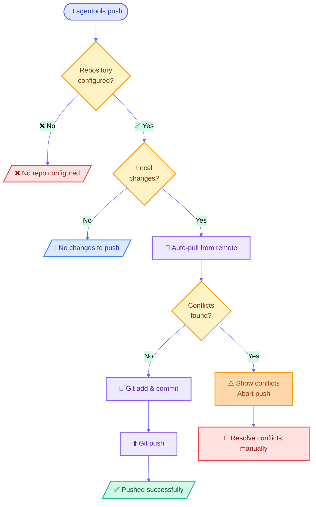

# Plan: Bi-directional Sync Feature

> Thêm tính năng push local skills lên GitHub repository

**Version**: v2.3.0  
**Created**: 2026-02-13  
**Status**: Planning

---

## 🏗️ Design

### Single Repo Philosophy

```
~/.agentools/
├── config.json                 # Config với repo duy nhất
└── sync-repo/                  # Local git clone của repo
    └── .agents/                 # Chỉ có folder này
        ├── skills/
        └── workflows/
```

**Config structure:**
```json
{
  "version": "2.3",
  "repository": {
    "url": "https://github.com/dongitran/agentools.git",
    "branch": "main",
    "local": "~/.agentools/sync-repo",
    "autoSync": true
  },
  "sync": {
    "conflictResolution": "pull-first"
  }
}
```

### Repository Structure

```
my-ai-skills/                   # GitHub repo
├── .agents/
│   ├── skills/
│   └── workflows/
├── .gitignore
└── README.md                   # Optional
```

---

## 🔧 Implementation

### Phase 1: Config & Init
- Update config schema: add `repository` and `sync` fields
- New command: `agentools init --repo <url>`
- Clone repo to `~/.agentools/sync-repo/`

### Phase 2: Push/Pull Commands

#### Push Logic Flow



#### Implementation
- Create `package/scripts/sync-manager.js`
- Implement `push()`, `pull()`, `sync()` methods
- CLI commands: `agentools push/pull/sync`

### Phase 3: Conflict Handling
- **Auto-sync** (default): Always pull before push
- **Manual mode**: Disable via `agentools config set repository.autoSync false`
- **Dry-run**: Add `--dry-run` flag to preview changes

---

## 📝 Usage

### First-Time Setup
```bash
agentools init --repo https://github.com/yourname/my-ai-skills.git
# Edit skills in ~/.agentools/sync-repo/.agents/skills/
agentools push
```

### Multiple Machines
```bash
# Machine A
agentools init --repo https://github.com/yourname/my-ai-skills.git
agentools push

# Machine B  
agentools init --repo https://github.com/yourname/my-ai-skills.git
agentools pull
```

### Conflict Examples

**Auto-sync (default):**
```bash
$ agentools push
🔄 Auto-syncing from remote...
✅ Pushed successfully!
```

**Manual mode (optional):**
```bash
$ agentools config set repository.autoSync false
$ agentools push
⚠️  Remote has changes. Pull first: agentools pull
```

---

## ✅ Testing

### Unit Tests

**`package/scripts/sync-manager.js`:**
- `hasLocalChanges()` - detects uncommitted changes correctly
- `checkRemoteConflicts()` - identifies remote vs local divergence
- `parseConflicts()` - extracts conflict file paths from git output
- `expandPath()` - expands ~ to home directory
- `push()` - validates repo configured before pushing
- `pull()` - handles conflicts and updates lastSync timestamp

**`package/scripts/config-manager.js`:**
- Config schema v2.3 validation
- `repository` field validation (url, branch, local)
- Migration from v2.2 to v2.3
- Get/set repository config values

### Integration Tests

**Flow tests:**
1. **First-time init** - Clone repo → verify `.agents/` structure
2. **Push without conflicts** - Commit & push OK → verify remote updated
3. **Push with remote changes** - Auto-pull → merge → push OK
4. **Push with conflicts** - Auto-pull → show conflicts → abort
5. **Pull with conflicts** - Show conflict files → require manual resolution
6. **autoSync disabled** - Detect remote changes → abort without pull

**CLI tests:**
- `agentools init --repo <url>` - creates config & clones repo
- `agentools push` - executes full push flow
- `agentools pull` - pulls from remote
- `agentools sync` - pull + push combination
- `agentools config set repository.autoSync false` - updates config

**Test files:**
- `package/test/sync-manager.test.js`
- `package/test/cli-push-pull.test.js`
- `package/test/config-migration.test.js`


---

## 📦 Deliverables

**New files:**
- `package/scripts/sync-manager.js`

**Modified files:**
- `package/bin/cli.js` - Add push/pull/sync commands
- `package/scripts/config-manager.js` - Update config schema
- `package/scripts/migration.js` - v2.2 → v2.3 migration
- `README.md`, `AGENT.md` - Documentation
- `package/package.json` - Bump to v2.3.0

---

## 🎯 Success Criteria

1. ✅ `agentools init --repo <url>` để setup
2. ✅ `agentools push` đơn giản để push changes
3. ✅ Detect conflicts và require pull first
4. ✅ Auto-sync option available
5. ✅ Repo structure chỉ chứa `.agents/`
6. ✅ Backward compatible với v2.2

---

**Next Steps:**
1. ✅ Review plan
2. ⏳ Implement Phase 1
3. ⏳ Implement Phase 2
4. ⏳ Implement Phase 3
5. ⏳ Unit & Integration Testing
6. ⏳ Release v2.3.0
7. ⏳ Manual Testing (install & test on local machine)
8. ⏳ Documentation update

